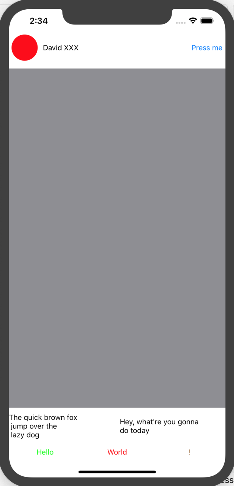

# Extensions

- Like the title, it's extension collected by phthphat
- Thanks to Vinova team, Brian Voong 

SampleView

```swift
vstack(
    hstack(
        UIImageView(backgroundColor: .red)
            .with(width: 50)
            .with(cornerRadius: 25),
        UILabel(text: "David XXX"),
        UIButton(title: "Press me", titleColor: .systemBlue, target: self, action: #selector(onTapBtn)),
        spacing: 10
    ).with(margins: .init(top: 5, left: 5, bottom: 5, right: 5)).with(height: 60),
    UIView(backgroundColor: .systemGray),
    hstack(
        UILabel(text: "The quick brown fox \n jump over the \n lazy dog", numberOfLines: 0),
        UILabel(text: "Hey, what're you gonna do today", numberOfLines: 0),
        spacing: 10
    ),
    hstack(
        UIButton(title: "Hello", titleColor: .green),
        UIButton(title: "World", titleColor: .red),
        UIButton(title: "!", titleColor: .brown),
        distribution: .fillEqually
    ),
    spacing: 10
)
```
